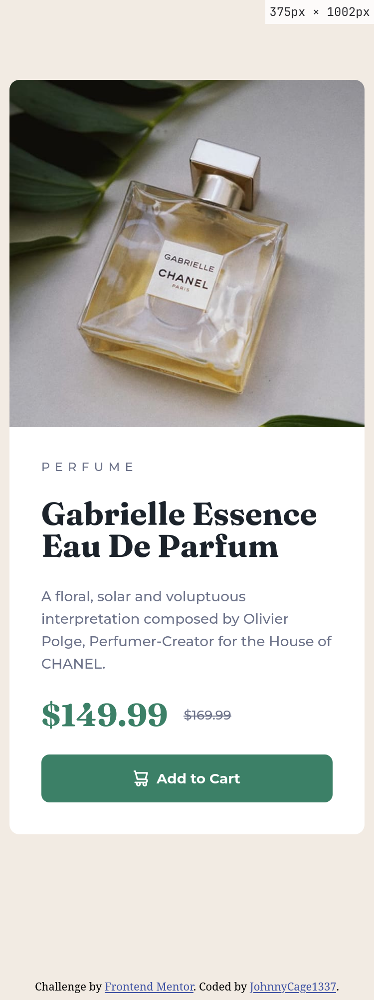
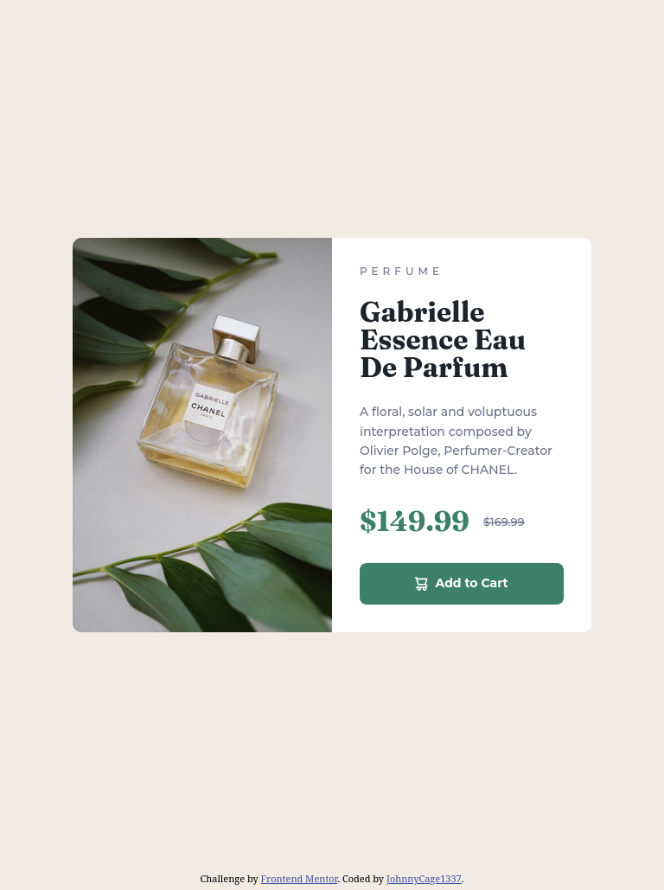
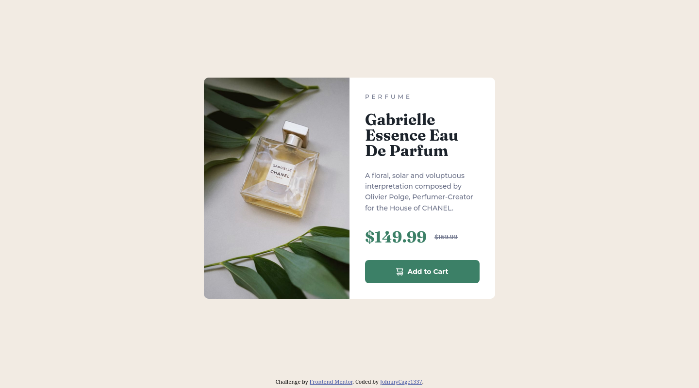

# Frontend Mentor - Product preview card component solution

This is a solution to the [Product preview card component challenge on Frontend Mentor](https://www.frontendmentor.io/challenges/product-preview-card-component-GO7UmttRfa). Frontend Mentor challenges help you improve your coding skills by building realistic projects.

## Table of contents

- [Overview](#overview)
  - [The challenge](#the-challenge)
  - [Screenshot](#screenshot)
  - [Links](#links)
- [My process](#my-process)
  - [Built with](#built-with)
  - [What I learned](#what-i-learned)
  - [Continued development](#continued-development)
  - [Useful resources](#useful-resources)
  - [AI Collaboration](#ai-collaboration)
- [Author](#author)


## Overview

### The challenge

Users should be able to:

- View the optimal layout depending on their device's screen size
- See hover and focus states for interactive elements

### Screenshot

#### Mobile

#### Tablet

#### Desktop


### Links

- Solution URL: [Github](https://github.com/JohnnyCage1337/Product-Preview-Card-Component)
- Live Site URL: [Github Pages](https://johnnycage1337.github.io/Product-Preview-Card-Component/)

## My process

### Built with

- Semantic HTML5 markup
- CSS custom properties
- Flexbox
- Mobile-first workflow

### What I learned

#### HTML

##### picture element `<picture>`
- Using the `<picture>` element, along with `<source>` and `` tags, allowed me to serve different images depending on the viewport width. This approach is especially useful when the images have different aspect ratios.
```css
      <picture class="card__picture">
        <source media="(min-width:48rem )" srcset="images/image-product-desktop.jpg" width="600" height="900">
        
      </picture>
```
*Note:* Using `srcset` on a single `` element makes more sense when the images you're swapping between have the same aspect ratio.

##### Strikethrough element `<s>`
- I used the `<s>` element, which stands for strikethrough, to show the original price crossed out.
```css
        <div class="card__price-group">
          <p class="card__price--new">$149.99</p>
          <s class="card__price--old">$169.99</s>
        </div>
```

### Continued development

In the future, I plan to focus on creating more complex layouts. I'm excited to try CSS Grid for my next project. I also want to begin learning JavaScript to build more interactive websites.

### Useful resources

- [W3Schools <picture> Tag](https://www.w3schools.com/Tags/tag_picture.asp) - This page was a great reference for understanding how the `<picture>` element works.
- [W3Schools <s> Tag](https://www.w3schools.com/tags/tag_s.asp) - A straightforward explanation of the strikethrough tag, which I used for the original price.**


## Author

- Frontend Mentor - [@JohnnyCage1337](https://www.frontendmentor.io/profile/JohnnyCage1337)


